# consultas1_sql

# EJERCICIOS CONSULTAS SQL

## Tabla usuario

## COMANDO SELECT

1. Para visualizar toda la información que contiene la tabla `usuario` se puede incluir con la instrucción SELECT el caracter '*' o cada uno de los campos de la tabla 

`select * from usuario` 

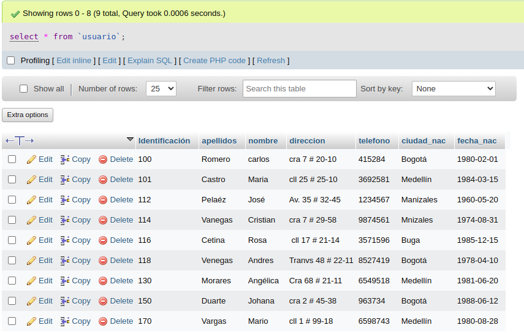

2. Visualizar solamente la identificación del usuario.

`select Identificacion from usuario`

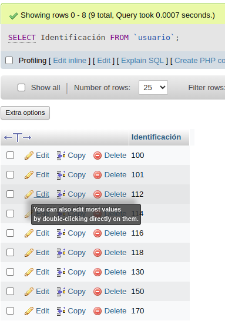

3. Si se desea obtener los registros cuya identificación sean mayores o iguales a 150, se debe utilizar la clausula WHERE que especifica las condiciones que deben reunir los registros que se van a seleccionar.

`SELECT * FROM usuario WHERE Identificación>='150'`

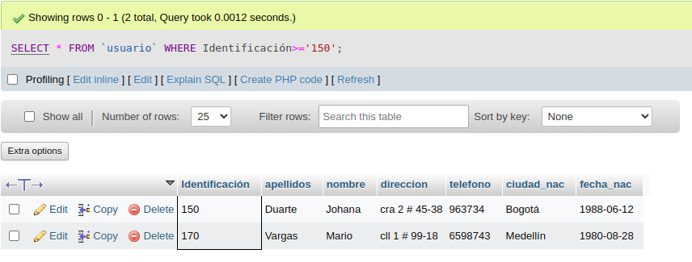

4. Si se desea obtener los registros cuyo sus apellidos sean Vanegas o Cetina, se debe utilizar el operador IN que especifica los registros que se quieren visualizar de una tabla.

`SELECT apellidos FROM usuario WHERE apellidos IN ('Vanegas','Cetina')`

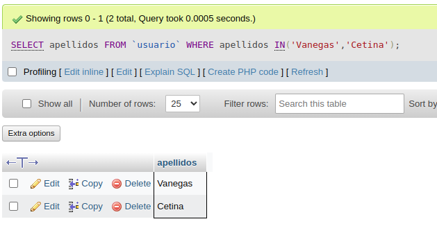

O se puede utilizar el operador OR.

`SELECT apellidos FROM usuario WHERE apellidos='Vanegas' OR apellidos='Cetina'`

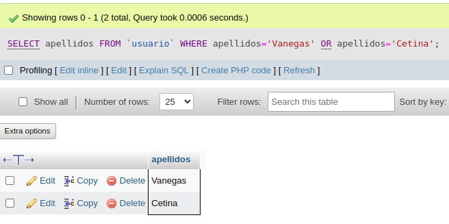

5. Si se desea obtener los registros cuya identificación sea menor de '110' y la ciudad sea 'Cali', se debe utilizar el operador AND.

`SELECT * FROM usuario WHERE Identificación<'110' AND ciudad_nac='Cali'`

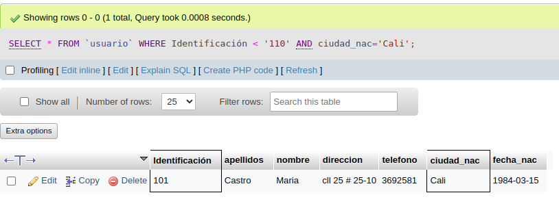

6. Si se desea obtener los registros cuyos nombres empiecen por la letra 'A', se debe utilizar el operador LIKE que utiliza los patrones '%' (todos) y '_' (caracter).

`SELECT * FROM usuario WHERE nombre LIKE 'A%'`

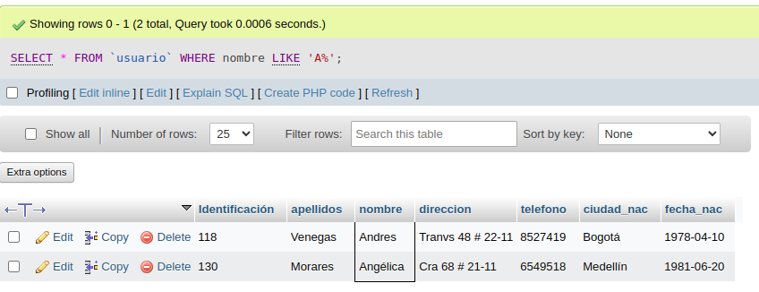

7. Si desea obtener los registros cuyos nombres contengan la letra 'a'.

`SELECT * FROM usuario WHERE nombre LIKE '%a%'`

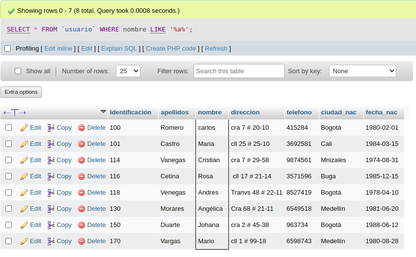

8. Si se desea obtener los registros donde la cuarta letra del nombre sea una 'a'.

`SELECT * FROM usuario WHERE nombre LIKE '___a%'`

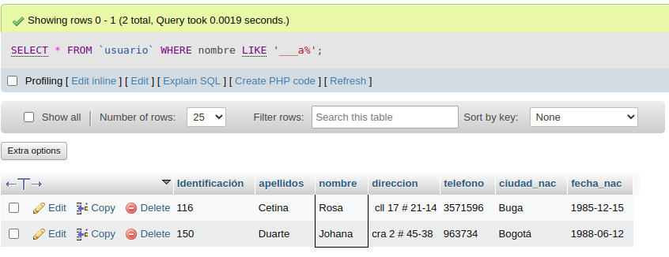

9. Si se desea obtener los registros cuya identificación esté entre el intervalo 110 y 150, se debe utilizar la cláusula BETWEEN, que sirve para especificar un intervalo de valores.

`SELECT * FROM usuario WHERE Identificación BETWEEN '110` AND '150'

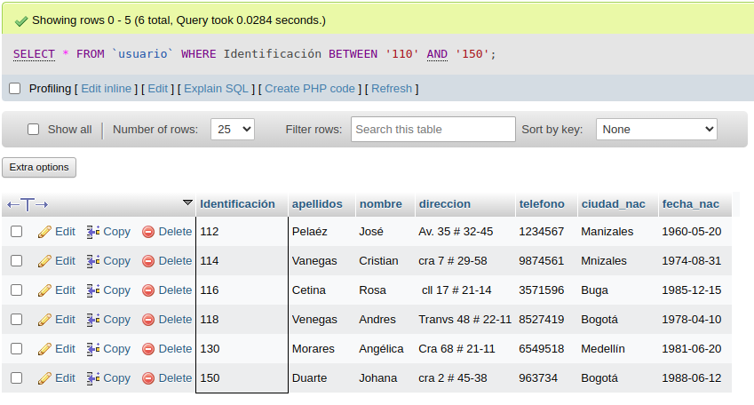

## COMANDO DELETE

10. Para elimiar solamente los registros cuya identificación sea mayor de 130.

`DELETE FROM usuario WHERE Identificación>'130'`

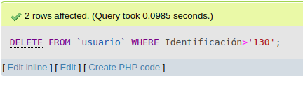
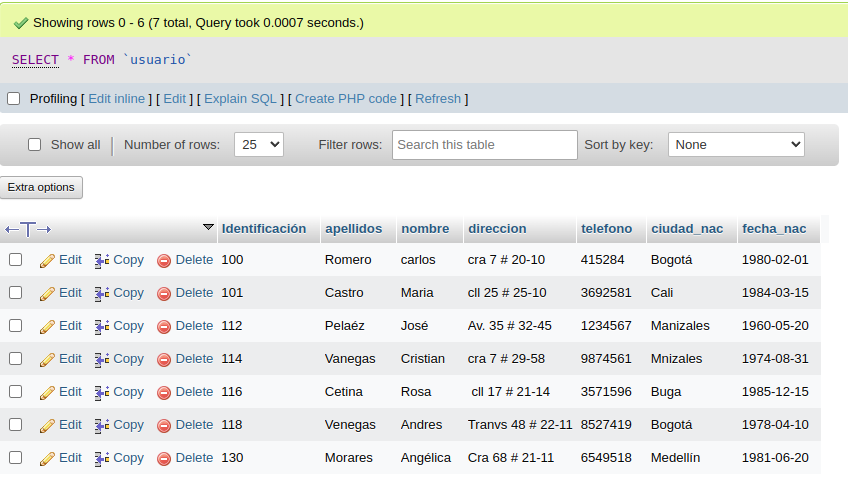

## COMANDO UPDATE

11. Para actualizar la ciudad de nacimiento de Cristian Vanegas, cuya Identificación es 114.

`UPDATE usuario SET ciudad_nac = 'Manizales' WHERE Identificación='114'`

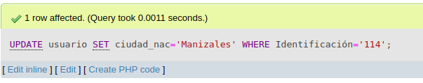
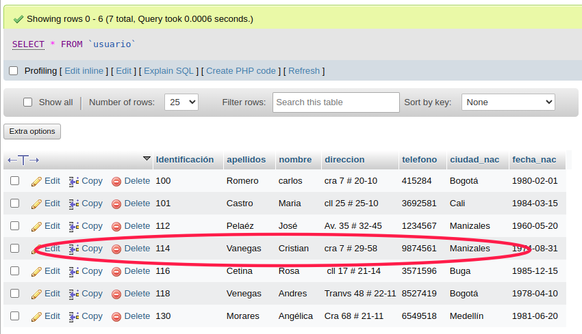

## INNER JOIN

Permite obtener datos de dos o mas tablas.  Cuando se realiza la concatenación de las tablas, no necesariamente se deben mostrar todos los datos de las tablas.

## Tabla pedidos

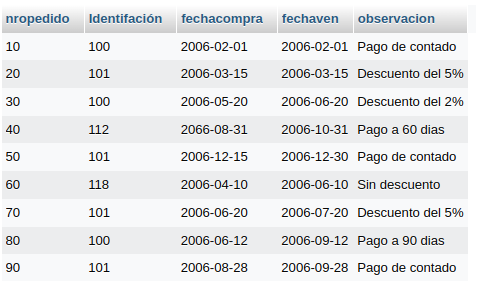

12. Para visualizar los campos idenficacion, nombre, apellidos de la tabla usuario y nropedido, fecha de compra, fecha de vencimiento y observación de la tabla pedidos, se debe realizar la siguiente instrucción SQL:

`SELECT usuario.Identifacion, usuario.nombre, usuario.apellidos, pedido.nropedido, pedidos.fechaCompra, pedidos.fechaVence, pedidos.observacion FROM usuario INNER JOIN pedidos ON usuario.Identificacion = pedidos.Identificacion`

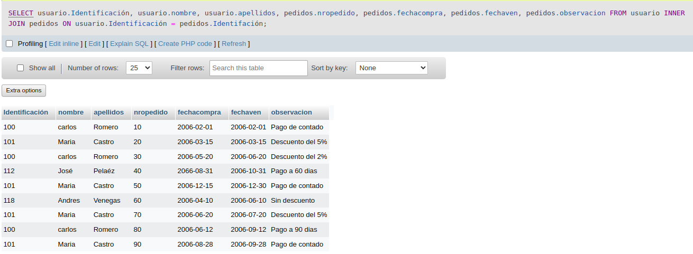

13. Para visualizar todos los campos de las tablas usuario y pedidos donde identificación sea mayor que 100, se debe realizar la siguiente instrucción:

`SELECT usuario.*, pedidos.* FROM usuario INNER JOIN pedidos ON usuario.Identificación = pedidos.Identificación WHERE usuario.Identificación > 100`

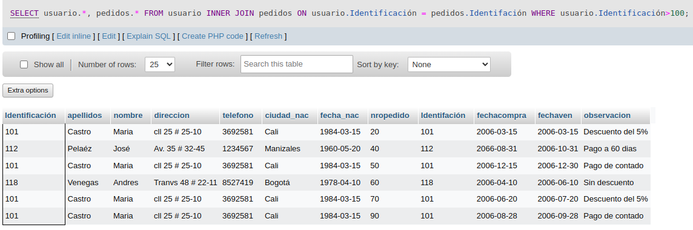
