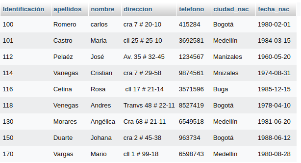

# consultas1_sql

#CONSULTAS SQL

1. Para visualizar toda la información que contiene la tabla `usuario` se puede incluir con la instrucción SELECT el caracter '*' o cada uno de los campos de la tabla 

`select * from usuario` 

2. Visualizar solamente la identificación del usuario.

`select Identificacion from usuario`